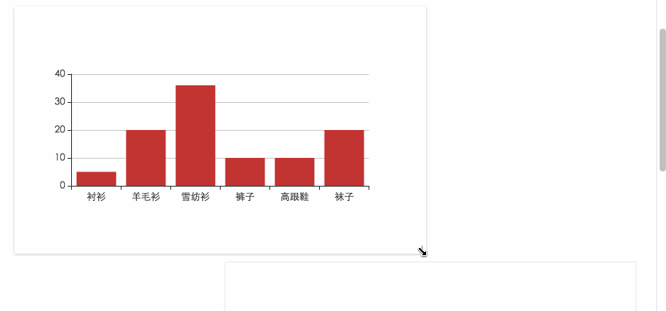

# react-echarts-v3
React component wrap for ECharts(v3.x)


## Feature

轻量，更高的效率，支持拖拽布局，支持按需引入 ECharts 的图表和组件。




## Installation

```
$ npm install --save react-echarts-v3
```


## Usage

``` javascript
import IECharts from 'react-echarts-v3';

const option = {
    title: { text: 'ECharts 入门示例' },
    tooltip: {},
    xAxis: {
        data: ["衬衫","羊毛衫","雪纺衫","裤子","高跟鞋","袜子"]
    },
    yAxis: {},
    series: [{
        name: '销量',
        type: 'bar',
        data: [5, 20, 36, 10, 10, 20]
    }]
};

return (
    <IECharts option={option} />
);
```

OR

``` javascript
import IECharts from 'react-echarts-v3/lib/echarts';

// Import all charts and components
// require('echarts/lib/chart/line');
require('echarts/lib/chart/bar');
// require('echarts/lib/chart/pie');
// require('echarts/lib/chart/scatter');
// require('echarts/lib/chart/radar');

// require('echarts/lib/chart/map');
// require('echarts/lib/chart/treemap');
// require('echarts/lib/chart/graph');
// require('echarts/lib/chart/gauge');
// require('echarts/lib/chart/funnel');
// require('echarts/lib/chart/parallel');
// require('echarts/lib/chart/sankey');
// require('echarts/lib/chart/boxplot');
// require('echarts/lib/chart/candlestick');
// require('echarts/lib/chart/effectScatter');
// require('echarts/lib/chart/lines');
// require('echarts/lib/chart/heatmap');

// require('echarts/lib/component/graphic');
// require('echarts/lib/component/grid');
// require('echarts/lib/component/legend');
// require('echarts/lib/component/tooltip');
// require('echarts/lib/component/polar');
// require('echarts/lib/component/geo');
// require('echarts/lib/component/parallel');
// require('echarts/lib/component/singleAxis');
// require('echarts/lib/component/brush');

// require('echarts/lib/component/title');

// require('echarts/lib/component/dataZoom');
// require('echarts/lib/component/visualMap');

// require('echarts/lib/component/markPoint');
// require('echarts/lib/component/markLine');
// require('echarts/lib/component/markArea');

// require('echarts/lib/component/timeline');
// require('echarts/lib/component/toolbox');

// require('zrender/lib/vml/vml');


const option = {
    title: { text: 'ECharts 入门示例' },
    tooltip: {},
    xAxis: {
        data: ["衬衫","羊毛衫","雪纺衫","裤子","高跟鞋","袜子"]
    },
    yAxis: {},
    series: [{
        name: '销量',
        type: 'bar',
        data: [5, 20, 36, 10, 10, 20]
    }]
};

return (
    <IECharts option={option} />
);
```


## propTypes

``` javascript
    className:  React.PropTypes.string,
    style:      React.PropTypes.object,
    theme:      React.PropTypes.string,
    option:     React.PropTypes.object.isRequired,
    notMerge:   React.PropTypes.bool,
    lazyUpdate: React.PropTypes.bool,
    onReady:    React.PropTypes.func,
    loading:    React.PropTypes.bool,
    onEvents:   React.PropTypes.object
```

[Read More](http://echarts.baidu.com/option.html)


## defaultProps

``` javascript
    className: 'react-echarts',
    style: { width: '100%', height: '100%' },
    notMerge: false,
    lazyUpdate: false,
    onReady: function(instance) {},
    loading: false,
    onEvents: {}
```


# License

MIT
